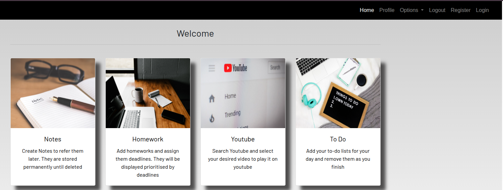

# Django Utility App


A simple Django application for **CRUD operations** and **consuming external APIs**.  
Designed to help manage data efficiently while integrating with external services.

## Features

- **Create, Read, Update, Delete (CRUD)** functionality for app models
- **External API integration** to fetch and display data
- User-friendly and responsive interface
- Modular and easy to extend

## Demo



## Installation

1. Clone the repository:

```bash
git clone https://github.com/your-username/django-utility-app.git
```


## License

This project is licensed under the MIT License. See the [MIT License](LICENSE) file for details.

---

If you have any questions or want to contribute, feel free to open an issue or submit a pull request.

